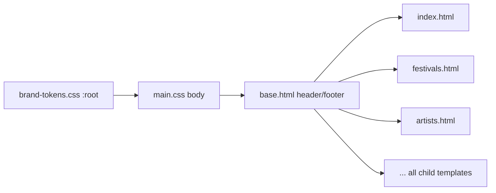

# Design Document: Brand Redesign

## Overview

This design covers the complete visual rebrand of the Festival Playlist Generator web UI from a bright indigo-themed interface to a dark, minimal, stage-inspired design system. The implementation touches three layers:

1. **Asset pipeline** — copy brand assets from `gig-prep-brand-assets/` into `web/static/brand/` so templates can reference them via standard static URLs.
2. **CSS architecture** — introduce `brand-tokens.css` as the single source of design tokens, overhaul `main.css` to consume those tokens, and migrate all inline `<style>` blocks from `base.html` into the stylesheet.
3. **Template changes** — update `base.html` (head, nav, footer, meta tags) and `index.html` (hero, content grid, cards) to use the new brand assets and dark theme. All child templates inherit the dark theme automatically through `base.html`.

The scope is purely front-end: HTML templates, CSS, and static asset files. No Python code changes are required beyond the asset copy step.

```mermaid
graph TD
    A[gig-prep-brand-assets/] -->|copy| B[web/static/brand/]
    B --> C[brand-tokens.css]
    C -->|@import| D[main.css]
    D --> E[base.html]
    E --> F[index.html]
    E --> G[festivals.html]
    E --> H[artists.html]
    E --> I[other child templates]
```

## Architecture

### File Structure

Brand assets are copied into a `brand/` subdirectory under the existing static root, mirroring the source folder structure:

```
web/static/
├── brand/
│   ├── css/
│   │   └── brand-tokens.css
│   ├── svg/
│   │   ├── logo.svg
│   │   ├── sigil.svg
│   │   └── sigil-pattern.svg
│   ├── png/
│   │   ├── logo-*.png
│   │   ├── sigil-*.png
│   │   ├── icon-dark-*.png
│   │   ├── grain-256.png
│   │   ├── grain-512.png
│   │   └── og-image-1200x630.jpg
│   ├── hero/
│   │   ├── hero-1920x1080.jpg
│   │   └── hero-1600x900.jpg
│   ├── ico/
│   │   └── favicon.ico
│   └── site.webmanifest
├── css/
│   └── main.css          ← overhauled
├── js/
│   └── ...               ← unchanged
└── ...
```

### CSS Load Order

```html
<!-- 1. Google Fonts -->
<link href="https://fonts.googleapis.com/css2?family=Inter:wght@400;500;600;700&family=Space+Grotesk:wght@500;700&display=swap" rel="stylesheet">
<!-- 2. Brand tokens (custom properties) -->
<link rel="stylesheet" href="/static/brand/css/brand-tokens.css">
<!-- 3. Main stylesheet (consumes tokens) -->
<link rel="stylesheet" href="{{ css_url('main.css') }}">
```

`brand-tokens.css` is loaded as a separate file (not `@import`ed inside `main.css`) so the tokens are available before `main.css` parses. This avoids a flash of unstyled content and keeps the token file as a standalone, replaceable unit.

### Theme Inheritance Model

All pages extend `base.html`. The dark theme is applied at the `body` level via tokens:



Because `body`, `.header`, `.footer`, `.container`, `.card`, and all component classes reference `var(--bg-*)`, `var(--text-*)`, and `var(--border)`, child templates inherit the dark theme without any per-page overrides.


## Components and Interfaces

### 1. Asset Pipeline (Copy Step)

A one-time file copy from `gig-prep-brand-assets/` into `web/static/brand/`. This can be a manual copy, a Makefile target, or a script. The directory mapping is:

| Source | Destination |
|--------|-------------|
| `gig-prep-brand-assets/svg/*` | `web/static/brand/svg/` |
| `gig-prep-brand-assets/png/*` | `web/static/brand/png/` |
| `gig-prep-brand-assets/hero/*` | `web/static/brand/hero/` |
| `gig-prep-brand-assets/ico/*` | `web/static/brand/ico/` |
| `gig-prep-brand-assets/css/brand-tokens.css` | `web/static/brand/css/` |
| `gig-prep-brand-assets/site.webmanifest` | `web/static/brand/` |

The `asset-usage.css` file is reference documentation only and is NOT copied — its patterns are incorporated directly into `main.css`.

The `site.webmanifest` icon paths must be updated from `/assets/png/` to `/static/brand/png/` to match the application's static file serving.

### 2. brand-tokens.css

Copied verbatim from the brand asset pack. Defines `:root` custom properties:

```css
:root {
  --bg-primary: #0A0A0A;
  --bg-secondary: #121212;
  --border: #1F1F1F;
  --text-primary: #F2F2F2;
  --text-secondary: #888888;
  --accent: #8A1C1C;
  --font-heading: "Space Grotesk", "Inter", Arial, sans-serif;
  --font-body: "Inter", Arial, sans-serif;
}
```

### 3. main.css Overhaul

Key changes to the existing stylesheet:

**Body & Reset:**
```css
body {
  font-family: var(--font-body);
  color: var(--text-primary);
  background-color: var(--bg-primary);
}
```

**Grain Overlay (new):**
```css
body::before {
  content: "";
  position: fixed;
  inset: 0;
  pointer-events: none;
  background: url("/static/brand/png/grain-256.png") repeat;
  opacity: 0.05;
  mix-blend-mode: screen;
  z-index: 9998;
}
```

**Headings:**
```css
h1, h2, h3, h4, h5, h6 {
  font-family: var(--font-heading);
}
```

**Header/Nav:**
- Background: `var(--bg-secondary)` instead of `#6366f1`
- Bottom border: `1px solid var(--border)`
- Nav links: `var(--text-primary)` with hover `var(--accent)`
- Admin link: `var(--accent)` background
- Auth button: `var(--accent)` background

**Cards (global):**
```css
.card, .feature-card, .festival-card, .service-card,
.search-filters, .playlist-header, .songs-container,
.overview-card, .help-section, .quick-actions-section {
  background: var(--bg-secondary);
  border: 1px solid var(--border);
  border-radius: 10px;
  padding: 1.25rem;
}
```

Card hover: lighten border to `#2a2a2a` or add subtle `box-shadow: 0 4px 12px rgba(0,0,0,0.3)`.

**Footer:**
```css
.footer {
  background: var(--bg-secondary);
  color: var(--text-secondary);
  border-top: 1px solid var(--border);
}
```

**Inline Style Migration:**
All `<style>` blocks from `base.html` (~160 lines of auth/dropdown/user-menu styles) move into `main.css`. Hardcoded colours are replaced with token references:
- `#6366f1` → `var(--accent)`
- `white` backgrounds → `var(--bg-secondary)`
- `#1f2937` text → `var(--text-primary)`
- `#e2e8f0` borders → `var(--border)`
- `linear-gradient(135deg, #667eea, #764ba2)` → `var(--accent)` solid or `var(--bg-secondary)`

### 4. base.html Template Changes

**`<head>` section:**
- Add Google Fonts `<link>`
- Add `brand-tokens.css` `<link>` before `main.css`
- Replace favicon references with brand versions
- Add PNG favicon links (sigil-32, sigil-16)
- Add Apple touch icon (icon-dark-180)
- Replace manifest link to `brand/site.webmanifest`
- Update `<meta name="theme-color">` to `#0A0A0A`
- Add Open Graph image meta tag
- Remove entire inline `<style>` block (moved to main.css)

**`<header>` section:**
- Replace `<h1 class="logo"><a href="/">🎵 Festival Playlists</a></h1>` with `<a href="/" class="logo"></a>`
- Auth controls remain structurally identical; styling comes from main.css

**`<footer>` section:**
- Update copyright text to reference "GIG-PREP" (preserving hyphen per guardrails)

### 5. index.html Template Changes

**DEV Banner:**
- Move inline styles to a `.dev-banner` class in main.css
- Keep `position: sticky; top: 0; z-index: 9999;` and red background

**Hero Section:**
- Add `position: relative; overflow: hidden` to `.hero`
- Background image via `::before` pseudo-element with grayscale filter
- Gradient fade via `::after` pseudo-element: `linear-gradient(to bottom, transparent 60%, var(--bg-primary))`
- Remove old `linear-gradient(135deg, #667eea, #764ba2)` background
- Headline uses `var(--font-heading)` at `2.5rem`+

**Content Grid (new):**
- Replace the existing "Features" and "Recent Festivals" sections with a `2fr 1fr` CSS Grid layout
- Left column: "Latest Setlists" section
- Right column: "Upcoming Shows" + "Quick Prep Checklist"
- Collapses to `1fr` at ≤768px
- Gap: `1.5rem`

**Feature Cards:**
- Apply `.card` dark styling (bg-secondary, border, border-radius)
- Remove white backgrounds and light box-shadows

### 6. Search Form (Dark Theme)

```css
.search-input-group {
  background: var(--bg-secondary);
  border: 1px solid var(--border);
}
.search-input {
  background: transparent;
  color: var(--text-primary);
}
.search-input::placeholder {
  color: var(--text-secondary);
}
.search-button {
  background: var(--accent);
}
```


## Data Models

This feature is purely front-end (CSS + HTML templates). There are no database models, API schemas, or server-side data structures to define.

The only structured data file is `site.webmanifest`, which must be updated to reflect the new static asset paths:

```json
{
  "name": "GIG-PREP",
  "short_name": "GIG-PREP",
  "theme_color": "#0A0A0A",
  "background_color": "#0A0A0A",
  "display": "standalone",
  "icons": [
    {
      "src": "/static/brand/png/icon-dark-192.png",
      "sizes": "192x192",
      "type": "image/png"
    },
    {
      "src": "/static/brand/png/icon-dark-512.png",
      "sizes": "512x512",
      "type": "image/png"
    }
  ]
}
```


## Correctness Properties

*A property is a characteristic or behavior that should hold true across all valid executions of a system — essentially, a formal statement about what the system should do. Properties serve as the bridge between human-readable specifications and machine-verifiable correctness guarantees.*

### Property 1: No bright legacy colours in the stylesheet

*For any* CSS rule in `main.css`, the rule's declarations shall not contain the hardcoded bright colour values `#f9fafb`, `#6366f1`, `#5856eb`, `#667eea`, `#764ba2`, or `#e0e7ff` (the old indigo/purple theme colours). The only exception is the DEV banner's `#dc3545` red, which is intentionally preserved.

**Validates: Requirements 3.4**

### Property 2: All card-like selectors use dark token styling

*For any* CSS selector in the set {`.feature-card`, `.festival-card`, `.festival-card-detailed`, `.service-card`, `.search-filters`, `.playlist-header`, `.songs-container`, `.overview-card`, `.help-section`, `.quick-actions-section`}, the selector's `background` or `background-color` declaration shall reference `var(--bg-secondary)` and its `border` declaration shall reference `var(--border)`.

**Validates: Requirements 8.1, 8.2, 8.6**

### Property 3: No inline style blocks in base.html

*For any* line in the rendered `base.html` template source, the template shall not contain `<style>` or `</style>` tags. All CSS shall be in external stylesheet files.

**Validates: Requirements 11.1**

### Property 4: Migrated auth styles use CSS custom properties

*For any* colour-related CSS declaration (properties: `color`, `background`, `background-color`, `border`, `border-color`, `box-shadow`) within the auth/user-menu rule blocks (`.auth-link`, `.user-menu-toggle`, `.user-dropdown`, `.user-avatar`, `.logout-btn`) in `main.css`, the value shall reference a `var(--*)` custom property rather than a hardcoded hex colour.

**Validates: Requirements 11.2**

### Property 5: Brand name hyphen preservation

*For any* occurrence of the brand name in HTML template files (`base.html`, `index.html`) and `site.webmanifest`, the text shall read "GIG-PREP" (with hyphen), never "GIGPREP", "Gig Prep", or "GigPrep".

**Validates: Requirements 13.1**


## Error Handling

### Hero Image Load Failure

If `hero-1920x1080.jpg` fails to load (404, network error), the `.hero` element has `background-color: var(--bg-secondary)` as a fallback. The `::before` pseudo-element's `background` shorthand uses `center/cover no-repeat`, so a missing image simply shows the solid dark background. No JavaScript fallback is needed.

### Google Fonts Load Failure

The font stacks include system fallbacks: `"Space Grotesk", "Inter", Arial, sans-serif` for headings and `"Inter", Arial, sans-serif` for body. If Google Fonts CDN is unreachable, the browser falls back to Arial, which is universally available. The layout does not break because no fixed-width assumptions are made.

### Missing Brand Assets

If any brand asset file is missing from `static/brand/` (e.g., `logo.svg`), the `` tag's `alt="GIG-PREP"` text renders as a text fallback. For favicon/manifest, browsers gracefully degrade to default icons. The grain overlay and sigil pattern are purely decorative — their absence has no functional impact.

### CSS Custom Property Fallback

If `brand-tokens.css` fails to load, all `var(--*)` references resolve to their initial values (typically `unset`). To mitigate this, the `body` rule in `main.css` can include hardcoded fallbacks:

```css
body {
  background-color: var(--bg-primary, #0A0A0A);
  color: var(--text-primary, #F2F2F2);
  font-family: var(--font-body, "Inter", Arial, sans-serif);
}
```

This pattern is applied to critical visual properties only (body background, text colour, font) to keep the stylesheet maintainable.

## Testing Strategy

### Unit Tests (Example-Based)

Unit tests verify specific, concrete expectations. Given that this feature is purely CSS/HTML, "unit tests" here means automated checks against file contents and template output.

**Asset existence tests:**
- Verify each expected file exists in `web/static/brand/` after the asset pipeline runs (Requirements 1.1–1.6)

**Template content tests:**
- Parse `base.html` and verify: Google Fonts link present (2.3), favicon links correct (5.1–5.4), OG image meta tag present (5.5), theme-color meta is `#0A0A0A` (3.5), no emoji logo text (4.1), logo.svg reference present (4.1)
- Parse `index.html` and verify: DEV banner element present (10.1–10.3), hero section structure present (6.1–6.5), content grid structure present (7.3–7.4)

**CSS content tests:**
- Parse `brand-tokens.css` and verify all 8 custom properties are defined with correct values (2.1, 2.2)
- Parse `main.css` body rule for token references (2.4, 2.5, 3.1, 3.2)
- Parse `main.css` heading rule for `var(--font-heading)` (2.5)
- Parse `main.css` .header rule for `var(--bg-secondary)` and border (4.2, 4.3)
- Parse `main.css` .footer rule for correct tokens (9.1–9.3)
- Parse `main.css` .container rule for max-width and padding (12.1, 12.2)
- Parse `main.css` .hero rules for position, overflow, ::before, ::after (6.1–6.6)
- Parse `main.css` .content-grid for grid-template-columns and gap (7.1, 7.2, 7.5)
- Parse `main.css` .dev-banner for sticky positioning and red background (10.1–10.3)

**Manifest test:**
- Parse `site.webmanifest` and verify icon paths point to `/static/brand/png/` (Data Models)

### Property-Based Tests

Property-based tests use a PBT library (e.g., `hypothesis` for Python, or a CSS-parsing approach) to verify universal properties across generated inputs. Each test runs a minimum of 100 iterations.

Each property test must be tagged with a comment referencing the design property:
- **Feature: brand-redesign, Property 1: No bright legacy colours in the stylesheet**
- **Feature: brand-redesign, Property 2: All card-like selectors use dark token styling**
- **Feature: brand-redesign, Property 3: No inline style blocks in base.html**
- **Feature: brand-redesign, Property 4: Migrated auth styles use CSS custom properties**
- **Feature: brand-redesign, Property 5: Brand name hyphen preservation**

**Property 1** — Parse all CSS rules in `main.css`, generate random rule indices, and verify none contain the banned bright colour hex values (excluding the DEV banner rule).

**Property 2** — For each card-like selector in the defined set, verify its declarations reference `var(--bg-secondary)` and `var(--border)`.

**Property 3** — Scan all lines of `base.html` and verify no `<style>` tags exist.

**Property 4** — For each colour-related declaration in auth/user-menu CSS rule blocks, verify the value contains `var(--` rather than a raw hex code.

**Property 5** — For each template file and manifest, scan for brand name occurrences and verify the hyphenated form "GIG-PREP" is used consistently.

### Visual / Manual Testing

Some requirements cannot be fully automated:
- 11.3 (auth UI visual preservation after style migration) — requires side-by-side comparison
- 13.3 (sigil not distorted) — requires visual inspection
- 6.2 (hero overlay appearance) — filter values can be checked in CSS, but the visual result needs human verification
- 8.5 (hover visual change) — CSS rule existence can be checked, but the "subtle" quality is subjective
- Responsive breakpoint behaviour (7.2, mobile layouts) — best verified with browser dev tools or Playwright visual regression
