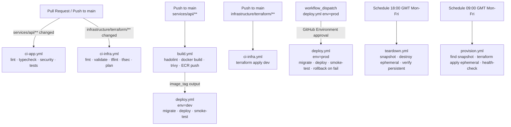

# Design Document: CI/CD Pipeline Rework

## Overview

The current CI/CD setup has three problems: the monolithic `pr.yml` runs all checks regardless of what changed, the deployment workflows (`deploy-app.yml`, `deploy-infra.yml`, `deploy-prod.yml`) duplicate test and build steps, and `terraform destroy` in the teardown workflow destroys everything including ECR and S3 — meaning Docker images and application data are lost each night.

This rework introduces six focused workflows, a persistent/ephemeral Terraform split, OIDC-based AWS authentication, and a Makefile-driven local development experience.

### Key Design Decisions

- **Path-filtered triggers** replace the monolithic CI: app changes trigger `ci-app.yml`, infra changes trigger `ci-infra.yml`. Both can trigger on the same PR if both paths change.
- **Build-once, deploy-many**: `build.yml` produces a tagged image; `deploy.yml` consumes it. The image tag flows between workflows via `workflow_call` outputs.
- **Terraform module split**: persistent resources (ECR, S3, Secrets Manager, Route 53) move to a `persistent/` root module; ephemeral resources stay in the existing root. Teardown only targets the ephemeral root.
- **OIDC over long-lived keys**: GitHub Actions OIDC eliminates the need for `AWS_ACCESS_KEY_ID` / `AWS_SECRET_ACCESS_KEY` secrets.
- **GitHub Environments** enforce prod approval and provide environment-scoped secrets.

---

## Architecture

### Workflow Graph



### Workflow Inventory

| File | Trigger | Purpose |
|---|---|---|
| `.github/workflows/ci-app.yml` | PR / push to main on `services/api/**` | Lint, type-check, security scan, unit + integration tests, gitleaks |
| `.github/workflows/ci-infra.yml` | PR / push to main on `infrastructure/terraform/**` | fmt, validate, tflint, tfsec/checkov, plan (PR comment), apply (main push) |
| `.github/workflows/build.yml` | Push to main on `services/api/**` | hadolint, Docker build, Trivy scan, ECR push |
| `.github/workflows/deploy.yml` | Called by `build.yml` (dev) or `workflow_dispatch` (prod) | ECS task def update, migration, service deploy, smoke-test, rollback |
| `.github/workflows/teardown.yml` | Schedule 18:00 GMT Mon-Fri / `workflow_dispatch` | DB snapshot, `terraform destroy` ephemeral module, verify persistent intact |
| `.github/workflows/provision.yml` | Schedule 09:00 GMT Mon-Fri / `workflow_dispatch` | Find snapshot, `terraform apply` ephemeral module, health-check |

Existing files to be removed: `pr.yml`, `deploy-app.yml`, `deploy-infra.yml`, `deploy-prod.yml`, `scheduled-teardown.yml`, `scheduled-provision.yml`.

---

## Components and Interfaces

### ci-app.yml

Jobs (all run in parallel, gated by `quality-gate` summary job):

1. `gitleaks` — runs `gitleaks/gitleaks-action` to detect committed secrets
2. `lint` — black check, isort check, flake8 (working-directory: `services/api`)
3. `type-check` — mypy strict mode
4. `security` — bandit + pip-audit
5. `unit-tests` — pytest `-m "not integration"` with coverage upload
6. `integration-tests` — pytest `-m integration` with postgres + redis service containers
7. `quality-gate` — `needs` all above; fails if any failed

Concurrency: `cancel-in-progress: true` (CI runs are cheap to restart).

### ci-infra.yml

Jobs:

1. `static-analysis` — `terraform fmt -check`, `terraform validate`, tflint, tfsec (or checkov)
2. `plan` — `terraform plan` against dev backend; posts plan diff as PR comment via `actions/github-script`; runs on PRs only
3. `apply` — `terraform apply` against dev; runs on push to main only; `needs: static-analysis`

Concurrency group: `infra-dev` with `cancel-in-progress: false` (Terraform state must not be corrupted by concurrent runs).

### build.yml

Jobs:

1. `build-push`:
   - hadolint Dockerfile validation
   - Docker Buildx with GHA cache
   - Trivy vulnerability scan (SARIF upload)
   - Push to ECR: tags `{sha}` and `latest`
   - Outputs `image_tag: ${{ github.sha }}`

2. `trigger-deploy` — calls `deploy.yml` with `environment: dev`, `image_tag: ${{ needs.build-push.outputs.image_tag }}`

### deploy.yml (reusable workflow)

Inputs: `environment` (dev | prod), `image_tag` (string).

Jobs:

1. `deploy`:
   - `environment: ${{ inputs.environment }}` — enforces GitHub Environment protection rules (prod requires approval)
   - Terraform apply targeting only `module.compute.aws_ecs_task_definition.api`, `.worker`, `.api_service`, `.worker_service` with `api_image_tag` and `worker_image_tag` vars
   - `aws ecs wait services-stable`
   - ALB target group health check

2. `migrate` — `needs: deploy` — ECS run-task with `alembic upgrade head`

3. `smoke-test` — `needs: migrate` — health endpoint + API routing checks

4. `rollback` — `needs: smoke-test`, `if: failure() && inputs.environment == 'prod'` — reverts to previous task definition revision

Concurrency group: `deploy-${{ inputs.environment }}` with `cancel-in-progress: false`.

### teardown.yml

Jobs:

1. `snapshot` — creates RDS cluster snapshot, waits for availability
2. `destroy` — `needs: snapshot` — `terraform destroy -target` all ephemeral resources (see Terraform section)
3. `verify` — `needs: destroy` — asserts ECR, S3, Secrets Manager, Route 53 still exist
4. `cleanup` — `needs: destroy` — deletes snapshots older than 7 days

### provision.yml

Jobs:

1. `find-snapshot` — queries RDS for latest available snapshot
2. `apply` — `needs: find-snapshot` — `terraform apply` ephemeral module with `restore_from_snapshot` var
3. `wait-services` — `needs: apply` — `aws ecs wait services-stable`
4. `health-check` — `needs: wait-services` — polls `/health` endpoint

---

## Data Models

### Terraform Module Split

The core change is splitting the single Terraform root into two roots:

```
infrastructure/terraform/
├── persistent/          # NEW — ECR, S3, Secrets Manager, Route 53
│   ├── main.tf
│   ├── variables.tf
│   ├── outputs.tf
│   └── backend.tf       # separate state key: persistent/{env}/terraform.tfstate
└── (existing root)/     # Ephemeral — VPC, ECS, Aurora, ElastiCache, ALB, CloudFront, WAF, monitoring
    ├── main.tf           # references persistent outputs via remote_state data source
    ├── variables.tf
    └── ...
```

The ephemeral root reads persistent resource ARNs/URLs via:

```hcl
data "terraform_remote_state" "persistent" {
  backend = "s3"
  config = {
    bucket = "festival-playlist-terraform-state"
    key    = "persistent/${var.environment}/terraform.tfstate"
    region = "eu-west-2"
  }
}
```

### Persistent Module Resources

| Resource | Terraform resource | Lifecycle rule |
|---|---|---|
| ECR repository | `aws_ecr_repository.app` | `prevent_destroy = true` |
| S3 app-data bucket | `aws_s3_bucket.app_data` | `prevent_destroy = true` |
| S3 cloudfront-logs bucket | `aws_s3_bucket.cloudfront_logs` | `prevent_destroy = true` |
| Secrets Manager secrets | `aws_secretsmanager_secret.*` | `prevent_destroy = true` |
| Route 53 hosted zone | `aws_route53_zone.main` (data source, not managed) | n/a |

All five resources get `prevent_destroy = true` in the persistent module. The teardown workflow only runs `terraform destroy` against the ephemeral root, so these resources are never targeted.

### Ephemeral Module Resources (existing root, unchanged structure)

VPC, subnets, security groups, Aurora cluster, ElastiCache, ECS cluster + services + task definitions, ALB, CloudFront distribution, WAF, monitoring (CloudWatch alarms, dashboards).

### GitHub Actions OIDC

Replace `AWS_ACCESS_KEY_ID` / `AWS_SECRET_ACCESS_KEY` with an OIDC trust policy on an IAM role:

```hcl
# In persistent module or a separate iam/ module
resource "aws_iam_openid_connect_provider" "github" {
  url             = "https://token.actions.githubusercontent.com"
  client_id_list  = ["sts.amazonaws.com"]
  thumbprint_list = ["6938fd4d98bab03faadb97b34396831e3780aea1"]
}

resource "aws_iam_role" "github_actions" {
  name               = "festival-playlist-github-actions"
  assume_role_policy = data.aws_iam_policy_document.github_oidc_trust.json
}
```

Workflows use:

```yaml
permissions:
  id-token: write
  contents: read

- uses: aws-actions/configure-aws-credentials@v4
  with:
    role-to-assume: ${{ secrets.AWS_ROLE_ARN }}
    aws-region: eu-west-2
```

### Local Development (Makefile)

A `Makefile` at the repo root wraps common operations:

```
make up          # docker compose up -d
make down        # docker compose down
make test        # pytest inside container
make lint        # black + isort + flake8
make typecheck   # mypy
make format      # black + isort (auto-fix)
make migrate     # alembic upgrade head inside container
make localstack  # docker compose -f docker-compose.aws.yml up -d
make logs        # docker compose logs -f app
```

The existing `docker-compose.yml` (PostgreSQL, Redis, FastAPI, Celery worker, Celery beat, nginx) and `docker-compose.aws.yml` (LocalStack overlay) remain unchanged.

---

## Correctness Properties

*A property is a characteristic or behavior that should hold true across all valid executions of a system — essentially, a formal statement about what the system should do. Properties serve as the bridge between human-readable specifications and machine-verifiable correctness guarantees.*

### Property 1: App CI does not trigger on infra-only changes

*For any* commit that modifies only files under `infrastructure/terraform/` (no changes under `services/api/`), the `ci-app.yml` workflow SHALL NOT be triggered.

**Validates: Requirements 1.2**

### Property 2: Infra CI does not trigger on app-only changes

*For any* commit that modifies only files under `services/api/` (no changes under `infrastructure/terraform/`), the `ci-infra.yml` workflow SHALL NOT be triggered.

**Validates: Requirements 2.3**

### Property 3: Quality gate blocks on any check failure

*For any* run of `ci-app.yml` where at least one of lint, type-check, security, unit-tests, or integration-tests fails, the `quality-gate` job SHALL exit with a non-zero status, blocking the PR.

**Validates: Requirements 1.4, 1.3**

### Property 4: Persistent resources survive teardown

*For any* execution of `teardown.yml`, the ECR repository, S3 buckets, Secrets Manager secrets, and Route 53 hosted zone SHALL still exist and be accessible after the workflow completes.

**Validates: Requirements 6.2, 6.5, 7.3**

### Property 5: Teardown only destroys ephemeral resources

*For any* execution of `teardown.yml`, no resource tagged `Persistence = "true"` (ECR, S3, Secrets Manager) SHALL be deleted.

**Validates: Requirements 6.1, 6.2**

### Property 6: Deploy pipeline is environment-isolated

*For any* two concurrent invocations of `deploy.yml` targeting the same environment, the second invocation SHALL wait for the first to complete rather than running in parallel.

**Validates: Requirements 12.1, 12.4**

### Property 7: Prod deployment requires approval

*For any* invocation of `deploy.yml` with `environment = prod`, the workflow SHALL pause at the `deploy` job until a GitHub Environment reviewer approves, and SHALL NOT proceed without approval.

**Validates: Requirements 4.7, 8.5**

### Property 8: Prod smoke-test failure triggers rollback

*For any* prod deployment where the `smoke-test` job fails, the `rollback` job SHALL execute and revert the ECS service to the previous task definition revision.

**Validates: Requirements 4.6, 8.5**

### Property 9: Image tag flows from build to deploy without mutation

*For any* push to main that triggers `build.yml`, the image tag used to push to ECR SHALL be identical to the image tag passed to `deploy.yml` and used in the ECS task definition update.

**Validates: Requirements 3.2, 5.1**

### Property 10: Gitleaks blocks PRs containing secrets

*For any* pull request where gitleaks detects a secret pattern, the `ci-app.yml` workflow SHALL fail and the PR SHALL be blocked from merging.

**Validates: Requirements 11.4, 11.5**

### Property 11: CI pipeline cancels stale runs

*For any* branch where a newer `ci-app.yml` or `ci-infra.yml` run is queued while an older run is in progress for the same branch, the older run SHALL be cancelled.

**Validates: Requirements 12.3**

---

## Error Handling

### Terraform State Conflicts

Concurrency groups (`infra-dev`, `infra-prod`) with `cancel-in-progress: false` prevent two Terraform operations from running simultaneously against the same state file. If a workflow is manually cancelled mid-apply, the state lock must be manually released via `terraform force-unlock`.

### ECS Deployment Failures

The ECS service has `deployment_circuit_breaker { enable = true, rollback = true }` configured in Terraform. This provides a first layer of automatic rollback at the ECS level. The `deploy.yml` smoke-test provides a second layer for prod: if the health check fails after ECS stabilises, the rollback job reverts the task definition.

For dev, no automatic rollback is performed — the failed deployment is left in place for debugging.

### Snapshot Not Found During Provisioning

`provision.yml` handles the no-snapshot case gracefully: if no snapshot is found, `restore_from_snapshot = false` is passed to Terraform and a fresh Aurora cluster is created. This is expected on first-ever provisioning or after a snapshot retention expiry.

### Persistent Resource Accidental Targeting

`prevent_destroy = true` on all persistent resources causes Terraform to error with a clear message if any plan attempts to destroy them. This is a hard guard — the only way to remove these resources is to manually remove the lifecycle block and re-plan.

### OIDC Token Expiry

GitHub OIDC tokens are short-lived (≤1 hour). Long-running jobs (e.g. waiting for ECS stability) should be structured so the AWS credential step runs before the long wait, not after. The `aws-actions/configure-aws-credentials` action handles token refresh automatically within a single job.

### Docker Build Failures

If hadolint or Trivy fail, `build.yml` exits before pushing to ECR. No partial image is pushed. The `trigger-deploy` job is skipped because it `needs: build-push`.

---

## Testing Strategy

### Unit Tests

- Run via `pytest tests/ -m "not integration"` in `ci-app.yml`
- Cover business logic, service layer, utility functions
- Use mocks for external dependencies (Spotify API, database, Redis)
- Target: existing test suite passes; coverage report uploaded as artifact

### Integration Tests

- Run via `pytest tests/ -m integration` with real PostgreSQL and Redis service containers
- Cover database queries, cache operations, Alembic migration correctness
- Exit code 5 (no tests collected) treated as success during transition

### Smoke Tests (post-deployment)

- `GET /health` — validates `{"status": "healthy"}` response body
- `GET /docs` — validates non-5xx response (FastAPI docs available)
- `GET /api/v1/festivals` — validates non-5xx response
- `GET /nonexistent-route` — validates 404, not 5xx

### Property-Based Tests

Property-based testing uses **Hypothesis** (Python) for the application layer and **pytest** for workflow behaviour assertions.

Each property test MUST be tagged with a comment referencing the design property:
`# Feature: cicd-pipeline-rework, Property {N}: {property_text}`

Each property test MUST run a minimum of 100 iterations (Hypothesis default is 100; set `@settings(max_examples=100)` explicitly).

**Workflow trigger properties (Properties 1, 2)** are validated by inspecting the workflow YAML `on.push.paths` and `on.pull_request.paths` filters programmatically in a pytest test that parses the YAML and asserts path filter correctness.

**Persistent resource properties (Properties 4, 5)** are validated by a pytest test that:
1. Reads the persistent Terraform module
2. Asserts every resource in the persistent module has `prevent_destroy = true` in its lifecycle block
3. Asserts no resource in the ephemeral root module has `Persistence = "true"` tag without a corresponding entry in the persistent module

**Concurrency properties (Properties 6, 11)** are validated by parsing workflow YAML and asserting correct `concurrency` block configuration.

**Approval property (Property 7)** is validated by asserting the `deploy` job in `deploy.yml` references a GitHub Environment named `production` when `inputs.environment == 'prod'`.

**Image tag flow property (Property 9)** is validated by a unit test that traces the `image_tag` output from `build-push` through `trigger-deploy` inputs to `deploy.yml` inputs, asserting no transformation occurs.

### Terraform Validation

- `terraform fmt -check` — formatting
- `terraform validate` — syntax and provider schema
- tflint — module-specific linting rules
- tfsec or checkov — security misconfigurations (e.g. public S3 buckets, unencrypted resources)

These run in `ci-infra.yml` on every PR touching `infrastructure/terraform/**`.
